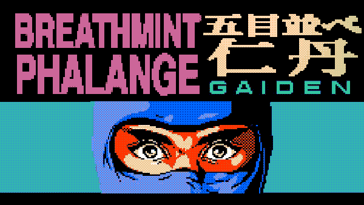

# :pill::pill: _Breathmint Phalange Gaiden_ :pill::pill:
A simple browser implementation of the classic game: Tic Tac Toe. Other working titles include: Tic Tac Toe Road.

A hosted version of this game can be found at: 
**[tictactoe.pink](http://tictactoe.pink)**. It will most likely be in the most recent commit/build of the code found here.

Alternatively, can be previewed from source using 
**[rawgit](https://rawgit.com/beug/breathmint_phalange_gaiden/master/index.html)** ™

Developed using **[p5js](https://p5js.org/)**

## Gameplay:
Will work on mobile, better on a tablet in landscape mode and best in a desktop browser *especially with fullscreen mode enabled*.

Tic Tac Toe is [historically](https://en.wikipedia.org/wiki/Gomoku) encoded as a "get a bunch of things in a row" sort of a deal. This flavor of the game borrows from that sensibility insofaras the game introduction alludes:

>Once upon a time in a pink tropical storm, TIC TAC and TOE descended from the heavens upon the roads of Monaco. 
Capture the beloved TIC TAC (with your cursor); avoid the dreaded TOE. Three in a row will either propell you to flavour fresh satisfaction, or precisely the inverse. 
 You could play this forever.

The player is charged with collecting Tictacs in a tictac container, and avoiding the toes. The game will track how many of each event happens in a row to eventually determine one of three outcomes: Win, Lose, or Draw. A rolling total of wins and losses is kept. An opportunity for possible enhancement involving a leaderboard is present here.

### Musings on 3D
Tictacs, toes, and the tictac container are all .obj models loaded into the WEBGL context of p5js. At the beginning of each round a random number tictacs and toes are called upon. It will be the same number of each. A possible development of levels could employ a more challenging circumstance of how many of each get generated in the round. As of this README, the collision detection only ~*works*~ within about 25 pixels of the mouse. Since the mouse/touch doesn't have a zed axis this is a bit of a contextual lie because the tictacs and the toes do.   